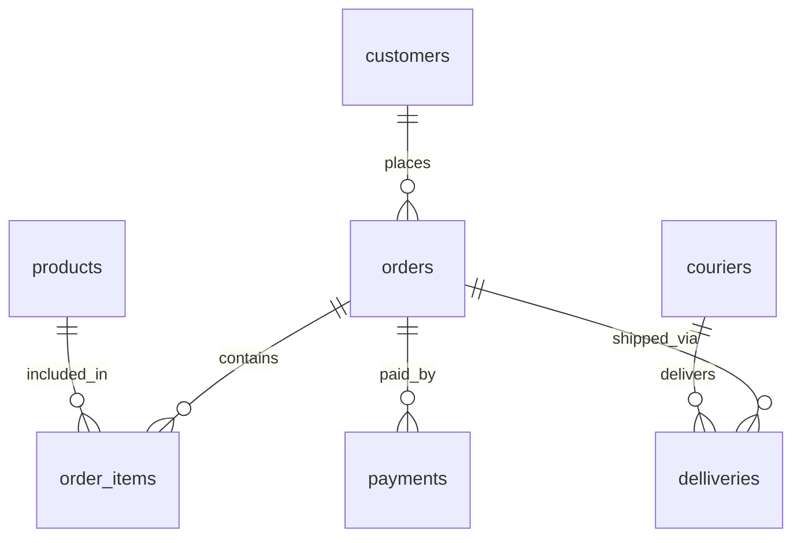

Online Shop Management Sustem

1.	Project Description
 

 1.1 Project Description

 
      Це система облку замовлень, товарів їх оплати та доставки. Вона дозволяє відстежувати замовлення від моменту його створення до моменту доставки клієнту.

 
 1.2 Problem to Solve

 
      Система полегшує та автоматизує роботу із замовланнями та доставкою. Без такої системи важче контролювати велику кількість замовлень, їх оплату та доставку.

 

 1.3 Users of the System

 

      Системою користуються працівники магазину та оператор системи.

 

 1.4 Data Stored in the Database

 
      У базі даних буде зберігатися інформація про клієнтів, товари, замовлення, оплати, доставку, кур’єрів та статуси замовленнь.

 
2.	Database Design

 
      Ця база даних містить сім таблиць
·	customers;
·	products;
·	couriers;
·	orders;
·	order_items;
·	payments;
·	delliveries.
 

2.0 ER Diagram

 2.1 Customers
 

      Таблиця customers містить інформацію про клієнтів.

 Поля:
·	customer_id – INTEGER PRIMARY KEY
·	first_name – TEXT NOT NULL
·	last_name – TEXT NOT NULL
·	phone – TEXT NOT NULL UNIQUE
·	email – TEXT NOT NULL UNIQUE

 
 2.2 Products

 
      Таблиця products містить інформацію про товари які є в магазині.
·	Поля:
·	product_id - INTEGER PRIMARY KEY
·	product-name - TEXT NOT NULL
·	price – REAL NOT NULL

 
 2.3 Couriers

 
      Таблиця couriers містить інформацію про дані кур’єрів які виконують доставку.

 
 Поля:
·	courier_id – INTEGER PRIMARY KEY
·	first_name – TEXT NOT NULL
·	last_name – TEXT NOT NULL
·	phone – TEXT NOT NULL UNIQUE

 2.4 Orders

 
      Таблиця orders містить дані замовлення.
 

 Поля:
·	order_id – INTEGER PRIMARY KEY
·	customer_id – INTEGER NOT NULL, FOREIGN KEY customer_id REFERENCES customers(customer_id)
·	order_date – TEXT NOT NULL
·	order_status – TEXT NOT NULL

 2.5 Order_items

 
      Таблиця order_items містить дані про замовлення.

 
 Поля:
·	order_item_id – INTEGER PRIMARY KEY
·	order_id – INTEGER NOT NULL, FOREIGN KEY order_id REFERENCES orders(order_id)
·	product_id – INTEGER NOT NULL, FOREIGN KEY product_id REFERENCES products(product_id)
·	quantity – INTEGER NOT NULL
·	price – REAL NOT NULL

 2.6 Payments

      Таблиця payments містить дані про оплату замовлень.

 Поля:
·	payment_id – INTEGER PRIMARY KEY
·	order_id – INTEGER NOT NULL, FOREIGN KEY order_id REFERENCES orders(order_id)
·	payment_date – TEXT NOT NULL
·	amount – REAL NOT NULL
·	payment_status – TEXT NOT NULL

 
 2.7 Delliveries

      Таблиця delliveries містить дані про доставку. 

 Поля:
·	dellivery_id – INTEGER PRIMARY KEY
·	order_id – INTEGER NOT NULL, FOREIGN KEY order_id REFERENCES orders(order_id)
·	courier_id – INTEGER NOT NULL, FOREIGN KEY courier_id REFERENCES couriers(courier_id)
·	dellivery_address – TEXT NOT NULL
·	dellivery_date – TEXT NOT NULL
·	dellivery_status – TEXT NOT NULL
3.	Relationships
·	customers → orders (1:M)
 Один клієнт може мати одне або кілька замовлень, але кожне замовлення належить лише одному клієнту. Позначення (1:М) означає зв’язок “один до багатьох”.
·	orders → order_items (1:M)
 Одне замовлення може містити  кілька продуктів.
·	products → order_items (1:M)
 Один продукт може міститися у декількох замовленнях.
·	orders → payments (1:M)
 Замовлення має оплату.
·	orders → delliveries (1:M)
 Замовлення має доставку.
·	couriers → delliveries (1:M)
 Кур’єр виконує доставку.
4.	Indexes
      Індекси використовуються для підвищення швидкості виконання запитів до бази даних. Вони допомагають швидше знаходити потрібні запити та ефективніше виконувати операції об’єднання таблиць.
      Індекси створені для зовнішніх ключів:
·	orders(customer_id);
·	order_items(order_id);
·	order_items(product_id);
·	payments(order)id);
·	delliveries(order_id);
·	delliveries(courier_id).
5.	Business Rules
·	конкретне замовлення належить конкретному клієнту;
·	замовлення може містити один або декілька продуктів;
·	кількість продуктів в order_items повинна бути додатною;
·	оплата пов’язана із конкретним замовленням;
·	доставка пов’язана із конкретнимзамовленням і кур’єром;
·	cтатус замовлення зберігається в orders. 

 

  
